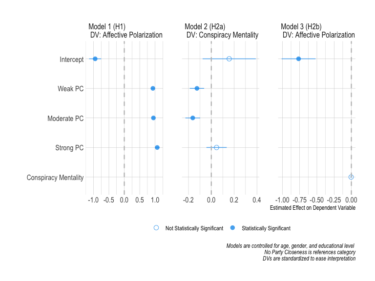
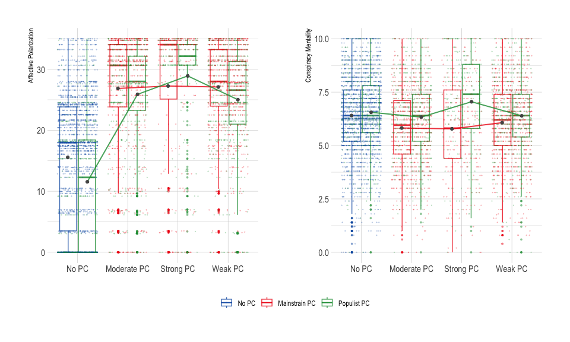
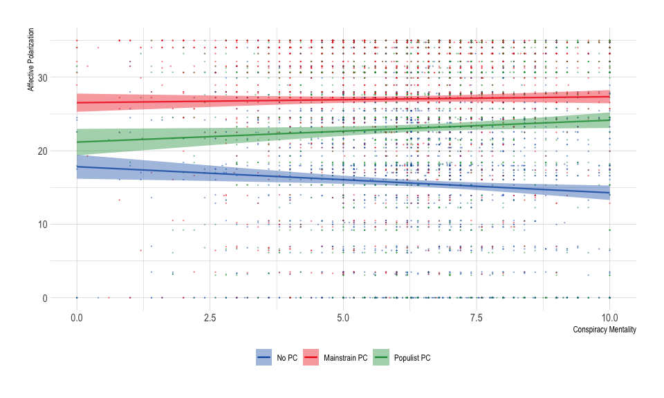
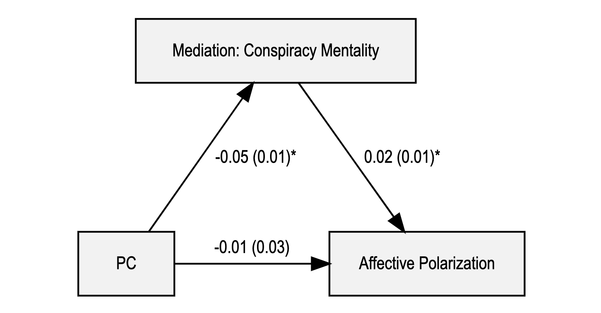
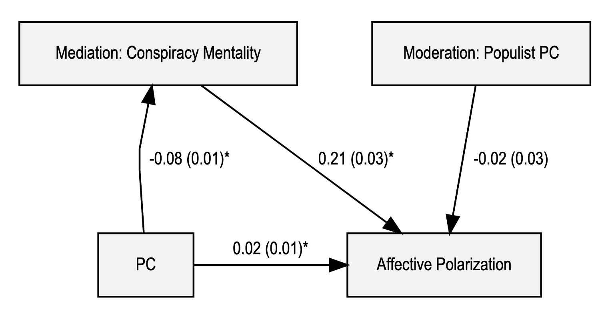

Analysis
================

- [Required Packages &
  Reproducibility](#required-packages--reproducibility)
- [Load Data](#load-data)
- [Table 1](#table-1)
- [Figure 1 (H1, H2a, H2b)](#figure-1-h1-h2a-h2b)
- [Figure 2](#figure-2)
- [Figure 3 (H3, mediation)](#figure-3-h3-mediation)
- [Figure 4 (H4, moderated mediation)](#figure-4-h4-moderated-mediation)

## Required Packages & Reproducibility

``` r
rm(list=ls())
detachAllPackages <- function() {
  
  basic.packages <- c("package:stats","package:graphics","package:grDevices","package:utils","package:datasets","package:methods","package:base")
  
  package.list <- search()[ifelse(unlist(gregexpr("package:",search()))==1,TRUE,FALSE)]
  
  package.list <- setdiff(package.list,basic.packages)
  
  if (length(package.list)>0)  for (package in package.list) detach(package, character.only=TRUE)
  
}
detachAllPackages()
source(here::here("src/lib/functions.R"))
```

## Load Data

``` r
load(here("data/intermediate/cleandata.RData"))
```

## Table 1

| vars                   | mean | stdev | type               |
|:-----------------------|-----:|------:|:-------------------|
| Affective Polarization | 21.7 |  11.2 | Full Data (N=6044) |
| Conspiracy Mentality   |  6.3 |   1.9 | Full Data (N=6044) |
| Political Trust        |  5.3 |   2.1 | Full Data (N=6044) |

| vars                   | mean | stdev | type                   |
|:-----------------------|-----:|------:|:-----------------------|
| Affective Polarization | 15.6 |  10.6 | No PC (N=2208)         |
| Conspiracy Mentality   |  6.4 |   1.8 | No PC (N=2208)         |
| Political Trust        |  4.9 |   2.1 | No PC (N=2208)         |
| Affective Polarization | 27.0 |   8.9 | Mainstream PC (N=2030) |
| Conspiracy Mentality   |  5.9 |   1.9 | Mainstream PC (N=2030) |
| Political Trust        |  5.9 |   2.0 | Mainstream PC (N=2030) |
| Affective Polarization | 23.1 |  10.7 | Populist PC (N=1806)   |
| Conspiracy Mentality   |  6.5 |   1.9 | Populist PC (N=1806)   |
| Political Trust        |  5.2 |   2.1 | Populist PC (N=1806)   |

| vars                   | df1 |  df2 | Fvalue | pvalue |
|:-----------------------|----:|-----:|-------:|-------:|
| Affective Polarization |   2 | 6041 |    709 |      0 |
| Conspiracy Mentality   |   2 | 6041 |     55 |      0 |
| Political Trust        |   2 | 6041 |    136 |      0 |

| contrast                  | estimate | conf.low | conf.high |
|:--------------------------|---------:|---------:|----------:|
| No PC-Mainstream PC       |   -11.46 |   -12.19 |    -10.74 |
| Populist PC-Mainstream PC |    -3.91 |    -4.67 |     -3.14 |
| Populist PC-No PC         |     7.56 |     6.81 |      8.31 |
| No PC-Mainstream PC       |     0.48 |     0.34 |      0.61 |
| Populist PC-Mainstream PC |     0.58 |     0.44 |      0.72 |
| Populist PC-No PC         |     0.10 |    -0.04 |      0.24 |
| No PC-Mainstream PC       |    -1.02 |    -1.17 |     -0.87 |
| Populist PC-Mainstream PC |    -0.78 |    -0.94 |     -0.62 |
| Populist PC-No PC         |     0.24 |     0.08 |      0.39 |

| x                      | y                    | type          |   cor |
|:-----------------------|:---------------------|:--------------|------:|
| Affective Polarization | Conspiracy Mentality | Full Data     | -0.04 |
| Affective Polarization | Conspiracy Mentality | No PC         | -0.06 |
| Affective Polarization | Conspiracy Mentality | Mainstream PC |  0.02 |
| Affective Polarization | Conspiracy Mentality | Populist PC   |  0.05 |
| Affective Polarization | Political Trust      | Full Data     |  0.10 |
| Affective Polarization | Political Trust      | No PC         |  0.12 |
| Affective Polarization | Political Trust      | Mainstream PC | -0.04 |
| Affective Polarization | Political Trust      | Populist PC   | -0.03 |
| Conspiracy Mentality   | Political Trust      | Full Data     | -0.29 |
| Conspiracy Mentality   | Political Trust      | No PC         | -0.26 |
| Conspiracy Mentality   | Political Trust      | Mainstream PC | -0.29 |
| Conspiracy Mentality   | Political Trust      | Populist PC   | -0.28 |

## Figure 1 (H1, H2a, H2b)

``` r
source(here("src/analysis/OLS.R"))
p1
```



## Figure 2

``` r
source(here("src/analysis/descriptive_viz.R"))
p2 + p3 + plot_layout(guides = "collect") & theme(legend.position = 'bottom')
```



``` r
p4
```



## Figure 3 (H3, mediation)

``` r
source(here("src/analysis/mediation.R"))
```



## Figure 4 (H4, moderated mediation)

``` r
source(here("src/analysis/moderated-mediation.R"))
```


