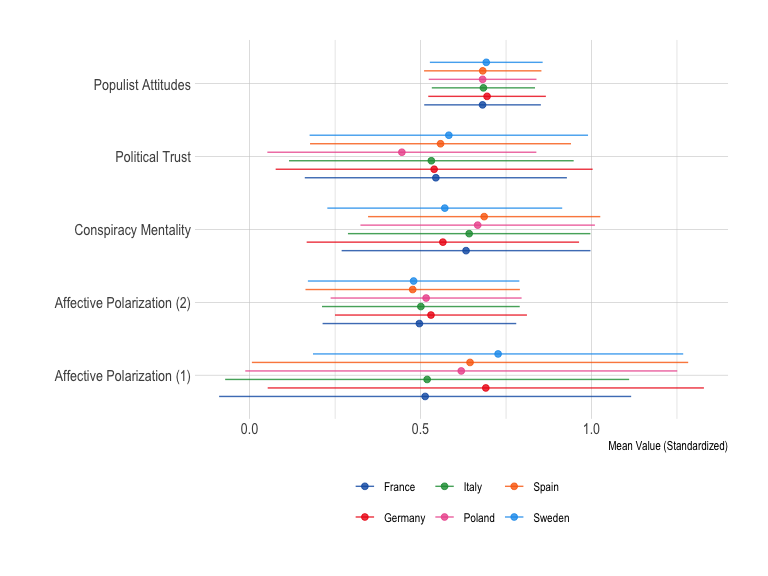
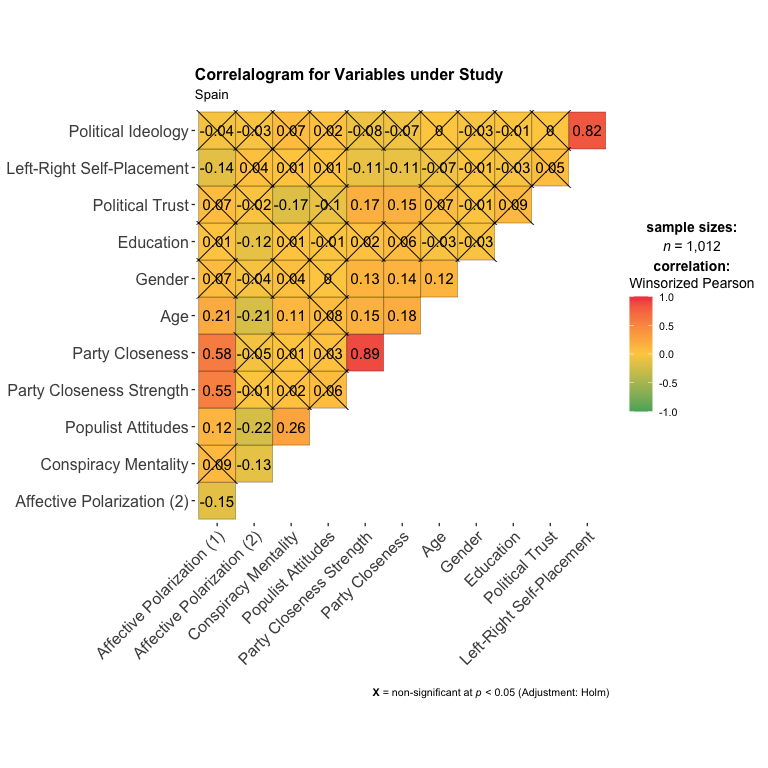
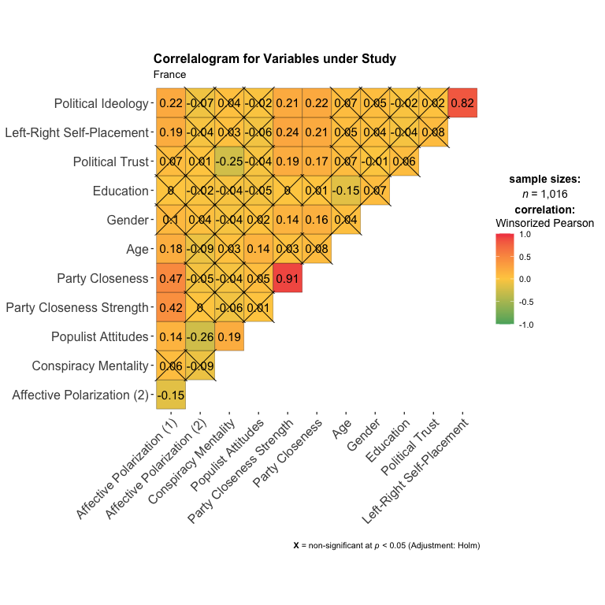
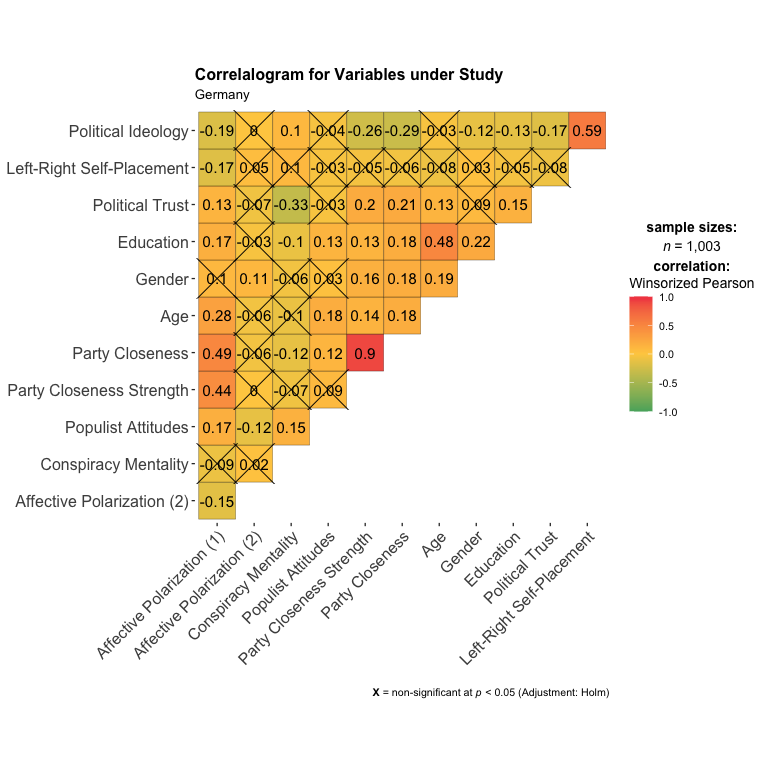

Prepare Data
================

- [Required Packages &
  Reproducibility](#required-packages--reproducibility)
- [Tidy & Save Data](#tidy--save-data)
- [Descriptives](#descriptives)

## Required Packages & Reproducibility

``` r
rm(list=ls())
source(here::here("src/lib/functions.R"))
#renv::snapshot()
```

## Tidy & Save Data

``` r
d <- read_sav(here("data/raw-private/kieskompas.sav")) 
source(here("src/data-processing/clean_data.R"))
save(d, file = here("data/intermediate/cleandata.Rdata"))
```

## Descriptives




